# Vue双向数据绑定原理探寻

## 双向数据绑定概述

Vue是一个MVVM框架，即数据双向绑定，即当数据发生变化的时候，视图也就发生变化，当视图发生变化的时候，数据也会跟着同步变化。这也算是Vue的精髓之处了。值得注意的是，我们所说的数据双向绑定，一定是对于UI控件来说的，非UI控件不会涉及到数据双向绑定。

> 该文档要做的就是实现了一个自定义Vue，逐步实现了数据的双向绑定，即数据驱动视图，视图驱动数据

## 手写双向数据绑定

### 界面与Vue实体类

**自定义HTML界面**

内部的界面形式采用Vue中的双向绑定的书写模式

一个Script标签引入Vue脚本，另一个Script标签写入标准的Vue2格式代码
```html
<!-- index.html -->
<!DOCTYPE html>
<html lang="en">
<head>
    <meta charset="UTF-8">
    <title>Title</title>
</head>
<body>
<div id="app">
    <span>打工人: {{name}}</span>
    <input type="text" v-model="name" />
    <span>工资：{{more.salary}}</span>
    <input type="text" v-model="more.salary" />
</div>
</body>
</html>

<script src="./Vue.js"></script>

<script>
    const vm = new Vue({
        el: '#app',
        data: {
            name: '西维',
            more: {
                salary: 1000
            }
        }
    })
    console.log(vm)
</script>
```
Vue.js脚本内部声明一个Vue实例，使用Vue惯用的`$data`和`$el`挂载数据和模版实例

```js
// Vue.js
class Vue{
    // 接收两个参数：模板（根节点），和数据对象
    constructor(options) {
        // 在vm中加入$data属性，挂载数据
        this.$data = options.data;
    }
}
```

此时启动页面，在浏览器的log界面中，我们就可以看到如下内容：

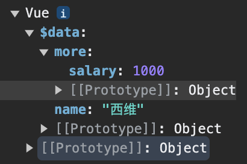

### 数据劫持 - Observer

Vue2中使用`Object.defineProperty()`进行数据劫持，Vue3进行了改进，使用`Proxy`。

具体的优势如下：
- 通过reactive定义的响应式数据使用proxy包装
- 解决了数组无法通过下标修改，无法监听到对象属性的新增和删除问题，也提升了响应式效率

我们继续改写Vue.js代码
```js
// Vue.js
class Vue{
    // 接收Vue中的数据
    constructor(options) {
        // 在vm中加入$data属性，挂载数据
        this.$data = options.data;
        // 数据劫持 - 拦截data所有属性的get/set
        new Observer(this.$data);
    }
}
```

通过Observer类来进行数据劫持
```js
// Observer.js
class Observer {
    constructor(data) {
        this.observer(data);
    }
    observer(obj) {
        // 在这里查看数据实例的属性
        console.log(Object.keys(obj));
    }
}
```
此时浏览器的调试页面如下：

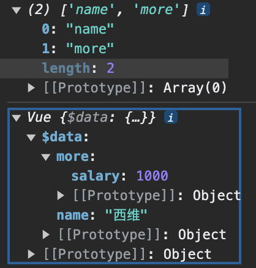

**之后我们通过`Object.defineProperty`函数进行数据劫持**，继续改写Observer类：

```js
// Observer.js
class Observer {
    constructor(data) {
        this.observer(data);
    }
    observer(obj) {
        // 遍历取出传入对象的所有属性, 给遍历到的属性都增加get/set方法
        for (let key in obj) {
            this.defineReactive(obj, key, obj[key])
        }
    }

    // obj: 需要操作的对象
    // attr: 需要新增get/set方法的属性
    // value: 需要新增get/set方法属性的取值
    defineReactive(obj, attr, value) {
        Object.defineProperty(obj, attr, {
            enumerable: true,
            configurable: true,
            get() {
                console.log(`访问了属性: ${attr} -> value: ${value}`);
                return value;
            },
            set: () => { }
        })
    }
}
```

在`getter`(即`get()`)中，我们要返回当前的属性值，否者会显示`undefined`

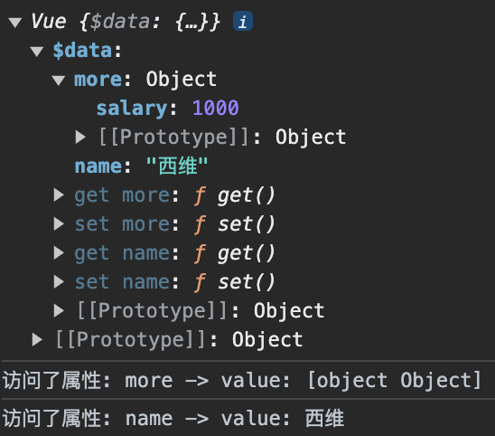

如上图，依次点开浏览器中Vue的属性值，会访问`getter`，然后会返回当前属性的值。

然后我们开始书写`setter`(即`set()`)代码，如下：

```js
// Observer.js
class Observer {
    constructor(data) {
        this.observer(data);
    }
    observer(obj) {
        // 遍历取出传入对象的所有属性, 给遍历到的属性都增加get/set方法
        for (let key in obj) {
            this.defineReactive(obj, key, obj[key])
        }
    }

    // obj: 需要操作的对象
    // attr: 需要新增get/set方法的属性
    // value: 需要新增get/set方法属性的取值
    defineReactive(obj, attr, value) {
        Object.defineProperty(obj, attr, {
            enumerable: true,
            configurable: true,
            get() {
                return value;
            },
            set: (newValue) => {
                // 判断当前输入的新值是否与旧值相等，优化措施
                if (value !== newValue) {
                    value = newValue;
                    console.log(`属性(${attr})的值(${value})被修改为：-> ${newValue}`);
                }
            }
        })
    }
}
```
这时，我们在浏览器给`$data.name`设置一个新值，输出如下：

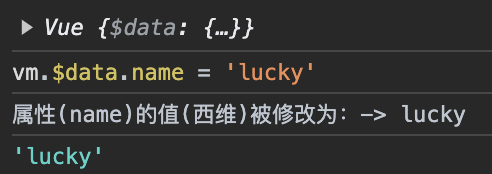

此时，虽然`$data`的数据已经被数据劫持，设置了`getter`和`setter`，但是如果本身就是`object`类型的数据，深层的数据没有被数据劫持，这时，我们就要使用递归进行遍历：

```js
// Observer.js
class Observer {
    constructor(data) {
        this.observer(data);
    }
    observer(obj) {
        // 进行深层递归遍历时，若属性值不是对象类型，则不向下遍历
        if (obj && typeof obj === 'object') {
            // 遍历取出传入对象的所有属性, 给遍历到的属性都增加get/set方法
            for (let key in obj) {
                this.defineReactive(obj, key, obj[key])
            }
        }
    }

    // obj: 需要操作的对象
    // attr: 需要新增get/set方法的属性
    // value: 需要新增get/set方法属性的取值
    defineReactive(obj, attr, value) {
        // 如果属性值是个对象类型，那么也需要对该对象的所有属性进行数据劫持
        this.observer(value);
        Object.defineProperty(obj, attr, {
            enumerable: true,
            configurable: true,
            get() {
                return value;
            },
            set: (newValue) => {
                // 判断当前输入的新值是否与旧值相等，优化措施
                if (value !== newValue) {
                    value = newValue;
                }
            }
        })
    }
}
```
这样，我们就进行了递归调用，让所有的初始属性都添加了`getter`和`setter`，但是，这里面还有一个问题，那就是我们认为的给了一个`obejct`类型的值，这时我们还需要在`setter`中添加数据劫持的函数：

```js
// Observer.js
class Observer {
    constructor(data) {
        this.observer(data);
    }
    observer(obj) {
        // ... 同上
    }

    // obj: 需要操作的对象
    // attr: 需要新增get/set方法的属性
    // value: 需要新增get/set方法属性的取值
    defineReactive(obj, attr, value) {
        // 如果属性值是个对象类型，那么也需要对该对象的所有属性进行数据劫持
        this.observer(value);
        Object.defineProperty(obj, attr, {
            enumerable: true,
            configurable: true,
            get() {
                return value;
            },
            set: (newValue) => {
                // 判断当前输入的新值是否与旧值相等，优化措施
                if (value !== newValue) {
                    // 如果给属性赋值的新值又是一个对象, 那么也需要给这个对象的所有属性添加get/set方法
                    this.observer(newValue);
                    value = newValue;
                }
            }
        })
    }
}
```
这样，我们的数据劫持`Observer`类就到这里完成了，接下来需要考虑的就是：

> 如何进行模版解析，将所需的`$data`渲染到模版中，挂载到指定根节点上？

### 模版解析 - Compile
#### Dom元素提取至内存(文档碎片对象)
> 主要是方便数据渲染到模版上

模版解析中，我们要先在Vue实体类中，获取到我们的模版;

```js
// Vue.js
class Vue{
    // 接收Vue实例中的数据
    constructor(options) {

        // 在vm中加入$el属性，挂载模版
        if (this.isElement(options.el)) {
            this.$el = options.el;
        } else {
            this.$el = document.querySelector(options.el);
        }

        console.log(this.$el.childNodes);

        // 在vm中加入$data属性，挂载数据
        this.$data = options.data;
        
        if (this.$el) {
            // 数据劫持 - 拦截data所有属性的get/set
            new Observer(this.$data);
        }
    }

    /**
     * 判断是否是一个DOM元素
     */
    isElement(node) {
        return node.nodeType === 1;
    }
}
```
此时，我们可以在浏览器中看到模版内的DOM元素：

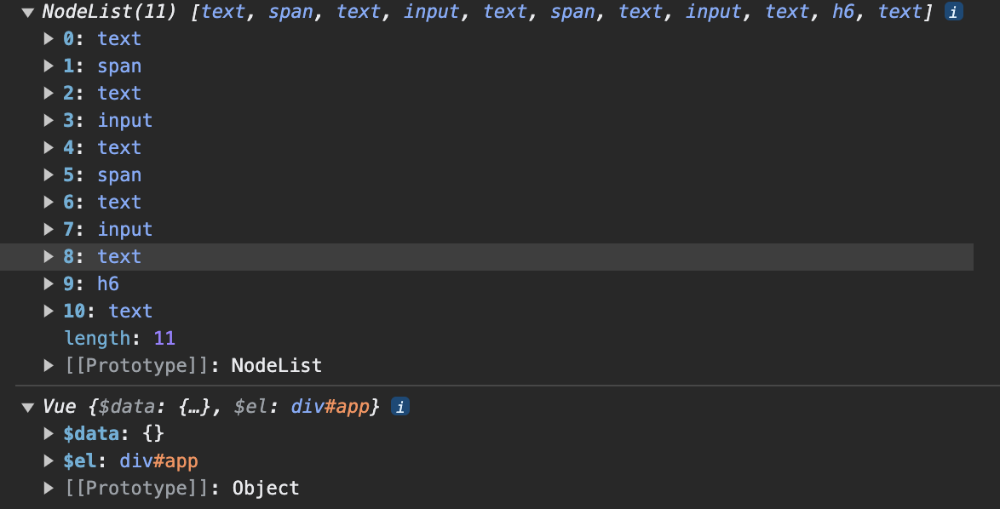

然后，书写`Compile`实体类，进行模版解析：

```js
// Vue.js
class Vue{
    // 接收Vue实例中的数据
    constructor(options) {
        // ... 同上
        
        if (this.$el) {
            // 数据劫持 - 拦截data所有属性的get/set
            new Observer(this.$data);
            // 模版解析 - 解析Vue指令
            new Compile(this);
        }
    }

    /**
     * 判断是否是一个DOM元素
     */
    isElement(node) {
        return node.nodeType === 1;
    }
}
```
```js
// Compile.js
class Compile {
    constructor(vm) {
        this.vm = vm;
        // 将网页上的元素放到内存中
        let fragment = this.node2Fragment(this.vm.$el);
    }

    node2Fragment($el) {
        // 创建一个空的文档碎片对象
        let fragment = document.createDocumentFragment();
        // 编译循环取到每一个元素
        let node;
        while (node = app.firstChild) {
            // 注意点: 只要将元素添加到了文档碎片对象中, 那么这个元素就会自动从网页上消失
            fragment.appendChild(node);
        }

        console.log(fragment.childNodes);
        // 3.返回存储了所有元素的文档碎片对象
        return fragment;
    }
}
```
现在我们就能看到我们的页面上的元素已经消失了，视图如下：

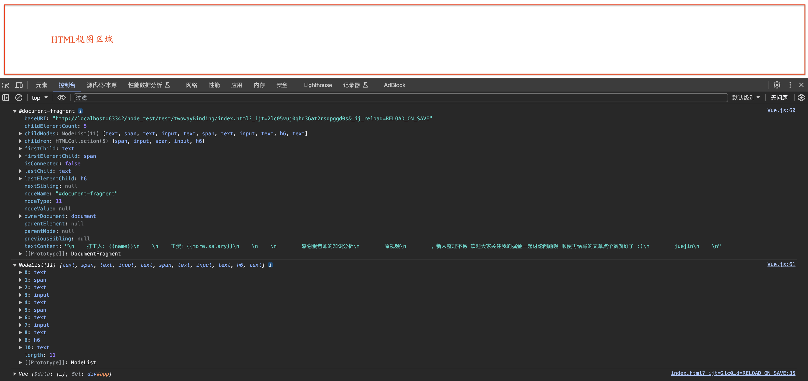

之前的视图如下：

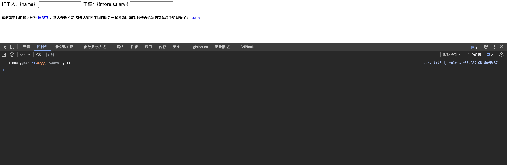

这种效果就是将元素放入到文档碎片的内存中，这样就不会在页面上显示了。

> DocumentFragment(文档碎片)
> 
> 定义：文档片段接口，表示一个没有父对象的最小文档对象。
> 
> 它被作为一个轻量版的 Document 使用，就像标准的 document 一样，存储由节点（nodes）组成的文档结构。与 document 相比，最大的区别是它不是真实 DOM 树的一部分，它的变化不会触发 DOM 树的重新渲染，且不会对性能产生影响。
> 
> 引用自[MDN的DocumentFragment文档](https://developer.mozilla.org/zh-CN/docs/Web/API/DocumentFragment)
#### 替换文档碎片对象内容

```js
// Compile.js
class Compile {
    constructor(vm) {
        // ... 同上
        // 利用指定的数据编译内存中的元素
        this.buildTemplate(fragment);
    }

    /**
     * 将节点放入节点碎片中国呢
     * @param app 网页上的元素
     * @return {DocumentFragment} 存储了所有元素的文档碎片对象
     */
    node2Fragment(app) {
        // ... 同上
    }

    /**
     * 替换内存(文档碎片对象)中内容
     * @param fragment 文档碎片对象
     */
    buildTemplate(fragment) {
        let nodeList = [...fragment.childNodes];
        nodeList.forEach(node => {
            // 需要判断当前遍历到的节点是一个元素还是一个文本
            if (this.vm.isElement(node)) {
                // 递归处理子元素
                this.buildTemplate(node);
            } else {
                console.log(node)
                console.log(node.nodeValue)
                // 文本节点
                this.buildText(node);
            }
        })
    }

    /**
     * 处理文本元素节点
     * @param textNode 文本元素节点
     */
    buildText(textNode) {
        // 双向绑定匹配的正则表达式
        const pattern = /\{\{\s*(\S+)\s*\}\}/;
    }
}
```
通过`buildTemplate()`函数，进行元素节点的判断，分为元素或文本；

然后通过`buildText()`函数，处理文本元素节点，进行替换;

输出如下：

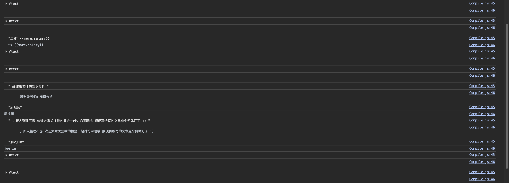

```js
// Compile.js
class Compile {
    // ... 同上

    /**
     * 处理文本元素节点
     * @param textNode 文本元素节点
     */
    buildText(textNode) {
        // 双向绑定匹配的正则表达式
        const pattern = /\{\{\s*(\S+)\s*\}\}/;
        const result_regex = pattern.exec(textNode.nodeValue);
        if (result_regex) {
            console.log(textNode.nodeValue);
            console.log(result_regex);
        }
    }
}
```
在`buildText()`函数通过`正则表达式.exec()`函数进行正则表达式匹配，找到标准语法(`{{ mode }}`)的文本节点

输出如下：

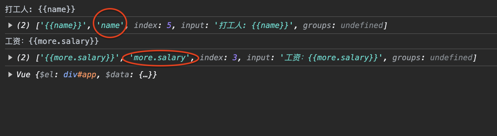

在输出的结果，其中我们需要的其实就是`result_regex[1]`，即属性key值，这样我们就可以通过这个值来获取到我们的`$data`中的数据了。

但是这里也有一个问题当我们要调用`$data`中的对象属性时(例如：`more.salary`)会出现`undefined`的情况；

```js
// Compile.js
class Compile {
    // ... 同上

    /**
     * 处理文本元素节点
     * @param textNode 文本元素节点
     */
    buildText(textNode) {
        // 双向绑定匹配的正则表达式
        const pattern = /\{\{\s*(\S+)\s*\}\}/;
        const result_regex = pattern.exec(textNode.nodeValue);
        if (result_regex) {
            console.log(this.vm.$data[result_regex[1]]);
        }
    }
}
```
输出如下：

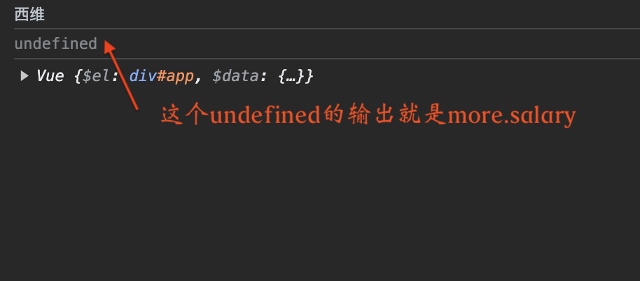

要想进行对象的链式调用，需要使用`reduce()`函数进行处理;

```js
// Compile.js
class Compile {
    // ... 同上

    /**
     * 处理文本元素节点
     * @param textNode 文本元素节点
     */
    buildText(textNode) {
        // 双向绑定匹配的正则表达式
        const pattern = /\{\{\s*(\S+)\s*\}\}/;
        const result_regex = pattern.exec(textNode.nodeValue);
        if (result_regex) {
            const value = result_regex[1].split('.')
                .reduce((value, current) => value[current], this.vm.$data);
            console.log(value);
        }
    }
}
```
这样我们就能得到正确的数值，输出如下：

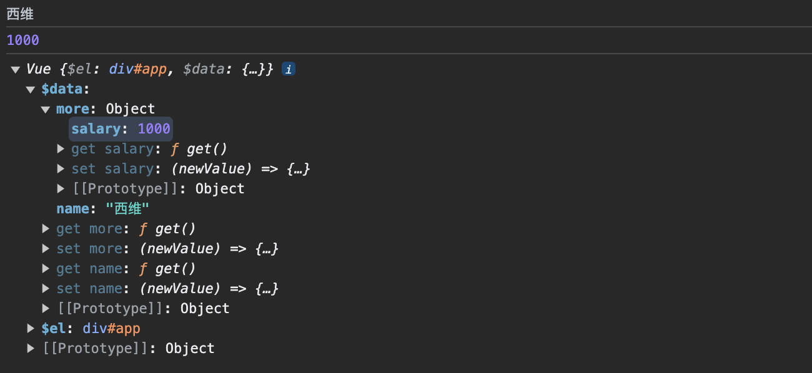

接下来，就讲插值表达式的值，替换到文本节点中去：

```js
// Compile.js
class Compile {
    // ... 同上

    /**
     * 处理文本元素节点
     * @param textNode 文本元素节点
     */
    buildText(textNode) {
        // 双向绑定匹配的正则表达式
        const pattern = /\{\{\s*(\S+)\s*\}\}/;
        const result_regex = pattern.exec(textNode.nodeValue);
        if (result_regex) {
            const value = result_regex[1].split('.')
                .reduce((value, current) => value[current], this.vm.$data);
            textNode.nodeValue = textNode.nodeValue.replace(pattern, value);
            console.log(textNode.nodeValue);
        }
    }
}
```
输出如下：

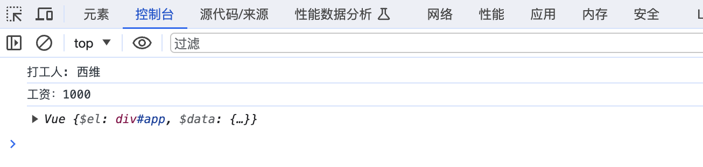

这时，我们就可以将文档碎片添加到`vm.$el`中去了：

```js
// Compile.js
class Compile {
    constructor(vm) {
        this.vm = vm;
        // 将网页上的元素放到内存中
        let fragment = this.node2Fragment(this.vm.$el);
        // 利用指定的数据编译内存中的元素
        this.buildTemplate(fragment);
        // 将编译好的内容重新渲染会网页上
        this.vm.$el.appendChild(fragment);
    }
    
    // ... 同上
}
```
界面输出如下：

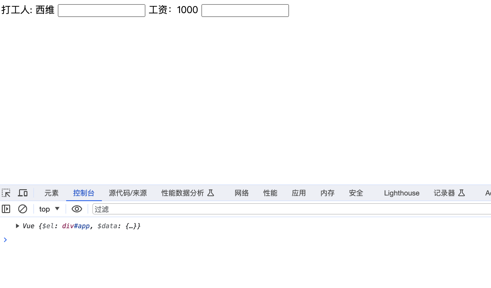

此时，我们已经可以数据劫持和将数据应用到界面上去，但是数据发生变动还是不能及时更新。

为了实现数据及时更新，接下来我们就要实现发布者-订阅者模式。

### 发布者-订阅者模式

#### Dependency
首先，我们先创建一个用于收集和通知订阅者的类。

```js
// Dependency.js
class Dependency {
    constructor() {
        // 订阅者数组 - 存放订阅者信息
        this.subscribers = [];
    }

    /**
     * 添加订阅者
     * @param sub
     */
    addSub(sub) {
        this.subscribers.push(sub);
    }

    /**
     * 通知订阅者
     */
    notify() {
        this.subscribers.forEach(sub => {
            sub.update();
        });
    }
}
```

#### 订阅者 - Watcher
然后，我们创建一个订阅者类，用于订阅数据的变化。

```js
// Wathcer.js
class Watcher {
    constructor(vm, key, callback) {
        // Vue实例
        this.vm = vm;
        // Vue实例对应的属性
        this.key = key;
        // 回调函数 - 记录如何更新文本内容
        this.callback = callback;
    }

    /**
     * 更新文本内容
     */
    update() {
        this.callback();
    }
}
```
接下来，我们要知道什么时候添加订阅者实例。其实就是在模版解析时进行添加。

```js
// Compile.js
class Compile {
    // ... 同上

    /**
     * 处理文本元素节点
     * @param textNode 文本元素节点
     */
    buildText(textNode) {
        // 双向绑定匹配的正则表达式
        const pattern = /\{\{\s*(\S+)\s*\}\}/;
        // 防止在替换中，数据发生变化，导致正则表达式匹配不到
        const template = textNode.nodeValue;
        const result_regex = pattern.exec(textNode.nodeValue);
        if (result_regex) {
            const value = result_regex[1].split('.')
                .reduce((value, current) => value[current], this.vm.$data);
            textNode.nodeValue = template.replace(pattern, value);
            // 创建订阅者
            const watcher = new Watcher(this.vm, result_regex[1], newValue => {
                textNode.nodeValue = template.replace(pattern, newValue);
            });
        }
    }
}
```
将Watcher实例添加到Dependency中去，这时就需要在Watcher的构造函数中添加一个临时变量，通过getter将Watcher添加到Dependency中去。

```js
// Wathcer.js
class Watcher {
    constructor(vm, key, callback) {
        // ... 同上
        
        // 临时变量
        Dependency.temp = this;
        // 读取属性值 - 触发get函数
        key.split('.')
            .reduce((value, current) => value[current], this.vm.$data);
    }

    // ... 同上
}
```
为了验证效果，我们在Observer类中添加log输出：

```js
// Observer.js
class Observer {
    // ... 同上
    
    // obj: 需要操作的对象
    // attr: 需要新增get/set方法的属性
    // value: 需要新增get/set方法属性的取值
    defineReactive(obj, attr, value) {
        // 如果属性值是个对象类型，那么也需要对该对象的所有属性进行数据劫持
        this.observer(value);
        Object.defineProperty(obj, attr, {
            enumerable: true,
            configurable: true,
            get() {
                console.log("触发getter，设置Dependency临时变量", Dependency.temp);
                return value;
            },
            set: (newValue) => {
                // 判断当前输入的新值是否与旧值相等，优化措施
                if (value !== newValue) {
                    // 如果给属性赋值的新值又是一个对象, 那么也需要给这个对象的所有属性添加get/set方法
                    this.observer(newValue);
                    value = newValue;
                }
            }
        })
    }
}
```
输出结果如下：

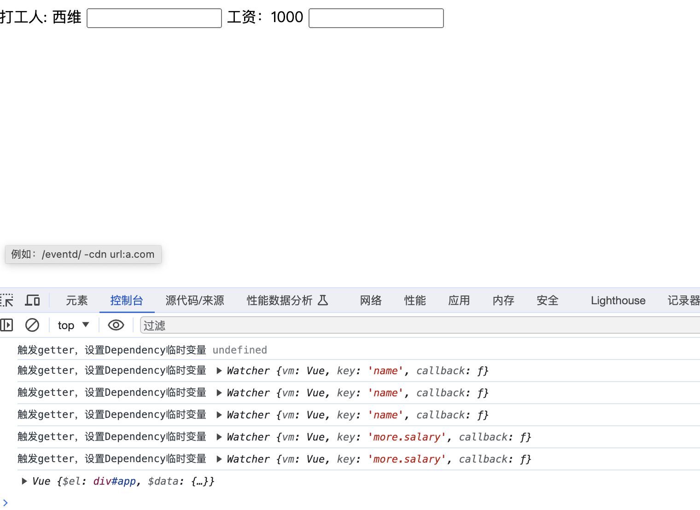

此时，我们就可以看到当前Dependency持有的Watcher实例了。

下一步我们就可以将Watcher实例添加到Dependency中去了。

```js
// Observer.js
class Observer {
    // ... 同上
    
    // obj: 需要操作的对象
    // attr: 需要新增get/set方法的属性
    // value: 需要新增get/set方法属性的取值
    defineReactive(obj, attr, value) {
        // 如果属性值是个对象类型，那么也需要对该对象的所有属性进行数据劫持
        this.observer(value);
        const dep = new Dependency();
        Object.defineProperty(obj, attr, {
            enumerable: true,
            configurable: true,
            get() {
                Dependency.temp && dep.addSub(Dependency.temp);
                return value;
            },
            set: (newValue) => {
                // 判断当前输入的新值是否与旧值相等，优化措施
                if (value !== newValue) {
                    // 如果给属性赋值的新值又是一个对象, 那么也需要给这个对象的所有属性添加get/set方法
                    this.observer(newValue);
                    value = newValue;
                }
            }
        })
    }
}
```
同时，为了防止重复添加同一个Watcher实例：

```js
// Wathcer.js
class Watcher {
    constructor(vm, key, callback) {
        // ... 同上
        
        // 临时变量
        Dependency.temp = this;
        // 读取属性值 - 触发get函数
        key.split('.')
            .reduce((value, current) => value[current], this.vm.$data);
        // 防止重复添加订阅者
        Dependency.temp = null;
    }

    // ... 同上
}
```
这样，订阅就完成了，然后我们需要到`setter`中进行通知更新。

```js
// Observer.js
class Observer {
    // ... 同上
    
    // obj: 需要操作的对象
    // attr: 需要新增get/set方法的属性
    // value: 需要新增get/set方法属性的取值
    defineReactive(obj, attr, value) {
        // 如果属性值是个对象类型，那么也需要对该对象的所有属性进行数据劫持
        this.observer(value);
        const dep = new Dependency();
        Object.defineProperty(obj, attr, {
            enumerable: true,
            configurable: true,
            get() {
                Dependency.temp && dep.addSub(Dependency.temp);
                return value;
            },
            set: (newValue) => {
                // 判断当前输入的新值是否与旧值相等，优化措施
                if (value !== newValue) {
                    // 如果给属性赋值的新值又是一个对象, 那么也需要给这个对象的所有属性添加get/set方法
                    this.observer(newValue);
                    value = newValue;
                    // 通知更新
                    dep.notify();
                }
            }
        })
    }
}
```
最后在`Watcher`类型，调用回调函数时还需要传入参数：

```js
// Wathcer.js
class Watcher {
    // ... 同上

    /**
     * 更新文本内容
     */
    update() {
        const value = this.key.split('.')
            .reduce((value, current) => value[current], this.vm.$data);
        this.callback(value);
    }
}
```

### v-model指令

在模版解析对`v-model`指令进行解析

```js
import Watcher from "./Watcher.js";

class Compile {
    // ... 同上

    /**
     * 替换内存(文档碎片对象)中内容
     * @param fragment 文档碎片对象
     */
    buildTemplate(fragment) {
        fragment.childNodes.forEach(node => {
            // 需要判断当前遍历到的节点是一个元素还是一个文本
            if (this.vm.isElement(node)) {
                this.buildElement(node);
                this.buildTemplate(node);
            } else {
                this.buildText(node);
            }
        })
    }

    /**
     * 处理元素节点
     * @param node
     */
    buildElement(node) {
        // 判断是否是输入框
        if (node.nodeName == 'INPUT') {
            let attrs = [...node.attributes];
            console.log(attrs);
        }
    }

    // ... 同上
}

export default Compile;
```
`log`输出如下：

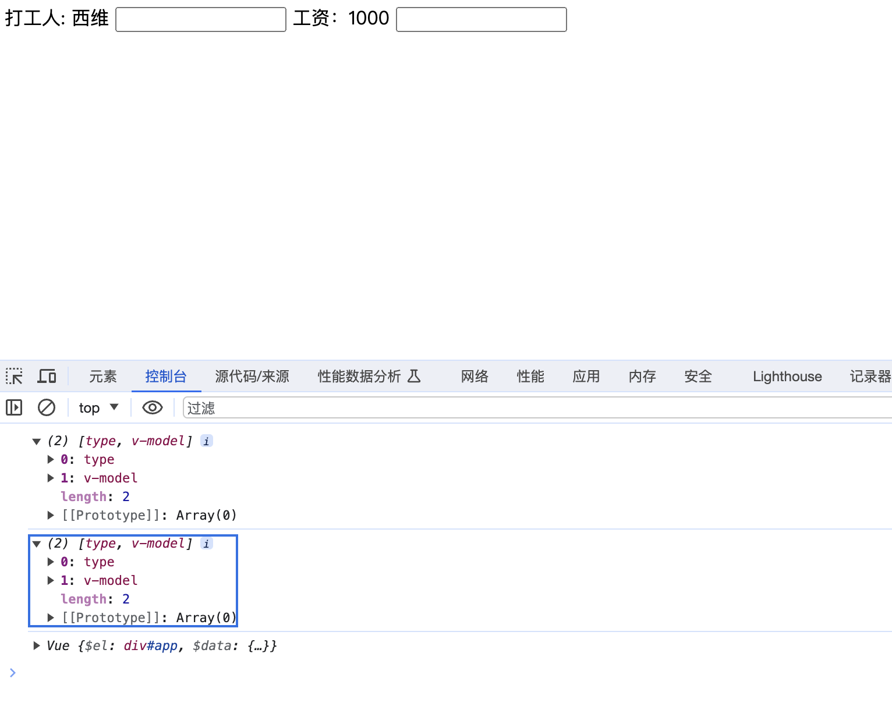

接下来，筛选出`v-model`指令：

```js
// Compile.js

class Compile {
    // ... 同上
    
    /**
     * 处理元素节点
     * @param node
     */
    buildElement(node) {
        // 判断是否是输入框
        if (node.nodeName == 'INPUT') {
            let attrs = [...node.attributes];
            attrs.forEach(attr => {
                if (attr.nodeName === 'v-model') {
                    console.log('v-model', attr.nodeValue);
                }
            });
        }
    }

    // ... 同上
}

export default Compile;
```
`log`输出如下：

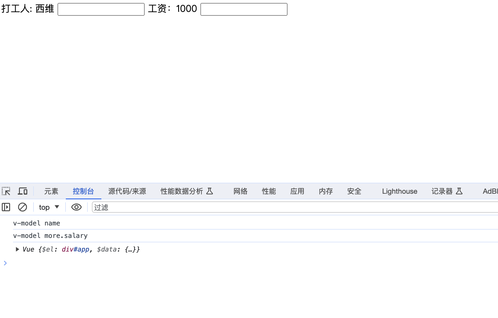

然后，我们通过链式调用将`vm.$data`中的数据取出来，放到输入框中，加入订阅者实例，添加订阅更新的回调函数:

```js
// Compile.js

class Compile {
    // ... 同上
    
    /**
     * 处理元素节点
     * @param node
     */
    buildElement(node) {
        // 判断是否是输入框
        if (node.nodeName == 'INPUT') {
            let attrs = [...node.attributes];
            attrs.forEach(attr => {
                if (attr.nodeName === 'v-model') {
                    const value = attr.nodeValue.split('.')
                        .reduce((value, current) => value[current], this.vm.$data);
                    node.value = value;
                    // 视图更新
                    new Watcher(this.vm, attr.nodeValue, newValue => {
                        node.value = newValue;
                    });
                }
            });
        }
    }

    // ... 同上
}

export default Compile;
```
此时，界面就变为：

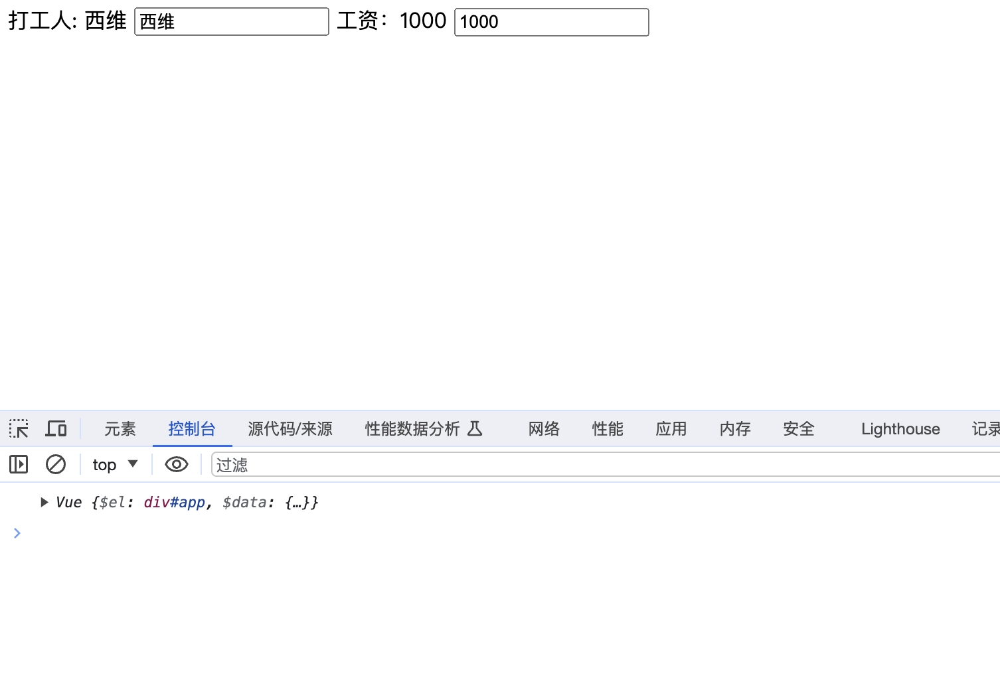

**最后**，通过在`v-model`指令的节点元素添加`input`事件，来实现数据输入：

```js
// Compile.js

class Compile {
    // ... 同上
    
    /**
     * 处理元素节点
     * @param node
     */
    buildElement(node) {
        // 判断是否是输入框
        if (node.nodeName == 'INPUT') {
            let attrs = [...node.attributes];
            attrs.forEach(attr => {
                if (attr.nodeName === 'v-model') {
                    const value = attr.nodeValue.split('.')
                        .reduce((value, current) => value[current], this.vm.$data);
                    node.value = value;
                    // 视图更新
                    new Watcher(this.vm, attr.nodeValue, newValue => {
                        node.value = newValue;
                    });

                    node.addEventListener('input', e => {
                        // 例如：obj.person.name 转化后为 keyArr = ['obj', 'person', 'name']
                        const keyArr = attr.nodeValue.split('.');
                        // 例如：keyArr经过slice(前闭后开的区间，前面索引的值包含，后面的不包含) 转化后为 keyArr2 = ['obj', 'person']
                        const keyArr2 = keyArr.slice(0, keyArr.length - 1);
                        // 例如：final = obj.person
                        const final = keyArr2.reduce((value, current) => value[current], this.vm.$data);
                        // 例如：final[keyArr[keyArr.length - 1]] = obj.person.name
                        final[keyArr[keyArr.length - 1]] = e.target.value;
                    });
                }
            });
        }
    }

    // ... 同上
}

export default Compile;
```
输入效果如下:
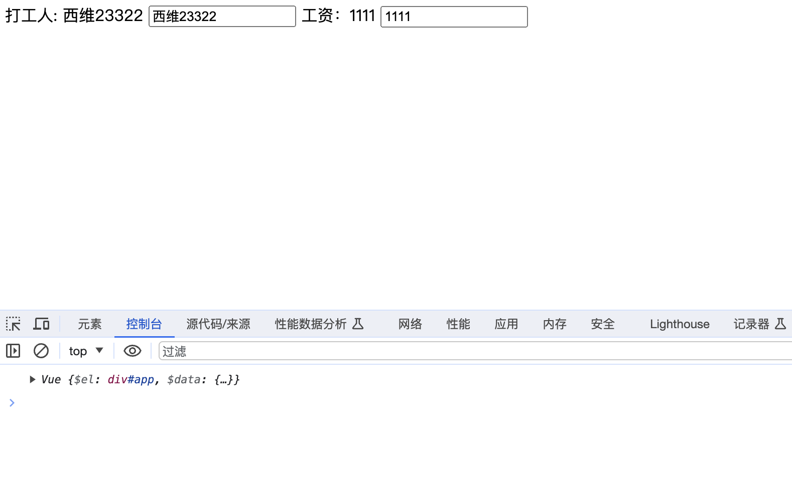


